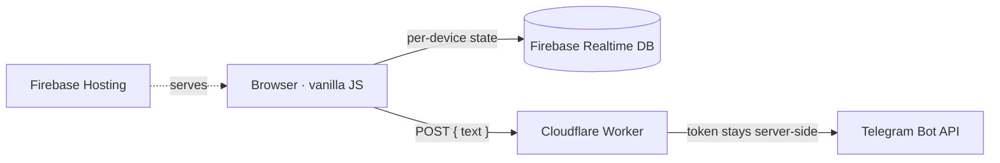

<div align="center">

# Heat Waves — an interactive gift

**A cinematic, one-of-one web experience built from scratch with vanilla JavaScript.**
No framework. No build step. Just HTML, CSS, the Canvas API, and a little serverless glue.

[](https://lisadiva.web.app)
&nbsp;


</div>

---

## ✨ Overview

This is a small interactive "experience" website — a personal gift dressed up as a short,
playful story. You arrive at a spinning vinyl record, the music starts, lyrics light up
**karaoke-style** word by word, and then the scene melts into a sunset where a shooting
star arcs down and bursts over a city skyline. From there you pick a date on a calendar,
unlock a little achievement, and the site quietly remembers everything for the next visit.

The whole thing is hand-built: a custom lyric-timing engine, a particle/explosion system
on a 2D canvas, per-device persistence, and a tiny serverless proxy — all with **zero
front-end dependencies and no bundler**.

## 🎬 The experience

| Step | What happens |
| --- | --- |
| **1 · Intro** | A vinyl player spins the track; the chorus sits centred and fills in word-by-word, while the rest of the song curves around the cover on a circular lyric ring. |
| **2 · Sunset** | The player dissolves into a painterly sunset. A spinning star falls along a Bézier arc and detonates over a skyline with a layered fireball, shockwaves, embers and smoke. |
| **3 · Calendar** | An interactive month picker (Monday-first, localized) to choose a day — with a playful "escape" button that refuses to be clicked. |
| **4 · Re-entry** | On return, the site greets you with a mystery screen and a side drawer holding your saved dates, wishes, achievements, and a replayable history of past visits. |

## 🧩 Features

- 🎤 **Custom karaoke engine** — per-word highlighting with eased, lingering fills on held notes; a circular character ring laid out around the rotating cover art.
- 🎆 **Canvas particle system** — additive-blended fireball, staggered shockwave rings, gravity-driven embers with trails and flicker, and drifting smoke.
- 🌌 **Generative starfield** — seeded constellations that link to nearby stars and to the cursor.
- 💾 **Per-device persistence** — state is namespaced per device in Firebase Realtime DB, with a transparent `localStorage` fallback so it never breaks offline.
- 🔔 **Serverless notifications** — a Cloudflare Worker relays interaction events to the author over Telegram while keeping the bot token **off the client entirely**.
- 🖼 **In-browser image keying** — the building photo is white-keyed to transparency and auto-trimmed on a canvas at load time, no pre-processing required.
- 📱 **Mobile-first & resilient** — robust autoplay unlocking for iOS/in-app browsers, safe-area handling, dynamic viewport-height fix, and `prefers-reduced-motion` support.

## 🏗 Architecture



The front end is a set of small IIFE modules with a single responsibility each, wired
together by one flow controller (`app.js`). The only server-side piece is the Cloudflare
Worker: the browser never holds the Telegram bot token — it posts a message to the Worker,
which adds the credentials and forwards it. That same indirection also sidesteps networks
that block the Telegram API directly.

## 🛠 Tech stack

| Layer | Choice | Why |
| --- | --- | --- |
| UI | **Vanilla JS (ES5-style IIFEs), CSS custom properties** | Zero dependencies, instant load, full control over every frame |
| Graphics | **Canvas 2D API** | Hand-written starfield, shooting star, and explosion |
| Data | **Firebase Realtime Database** (+ `localStorage` fallback) | Simple per-device sync without a backend |
| Notifications | **Cloudflare Workers** | Serverless proxy that keeps secrets off the client |
| Hosting | **Firebase Hosting** | One-command deploy, free TLS, global CDN |

## 📂 Project structure

```
.
├── index.html              # single entry point
├── css/                    # base tokens, intro/player, scene, components
├── js/
│   ├── config.js           # public Firebase config + notification endpoint
│   ├── data.js             # lyrics timeline + content
│   ├── firebase.js         # storage wrapper (RTDB + localStorage)
│   ├── telegram.js         # notification client (talks to the Worker)
│   ├── canvas.js           # starfield + shooting star + explosion engine
│   └── app.js              # flow controller / state machine / audio / karaoke
├── worker/                 # Cloudflare Worker (Telegram proxy)
├── firebase.json           # hosting + database config
└── database.rules.json     # Realtime Database security rules
```

## 🚀 Run it locally

It's fully static — serve the folder with anything:

```bash
npx serve .
# or
python -m http.server
```

To make the cloud features live, drop your own Firebase web config into `js/config.js`
and, optionally, deploy the Cloudflare Worker in `worker/` and point `proxyUrl`
at it. Without them the site still runs end-to-end on the `localStorage` fallback.

## 📝 Notes

- The Firebase web config in `js/config.js` is public by design (it's an identifier, not a
  secret); access is governed by the Realtime Database rules.
- The audio track is included for this personal demo only and remains the property of its
  rights holders.

<div align="center">
<sub>Built with care — every pixel, particle, and millisecond by hand.</sub>
</div>
